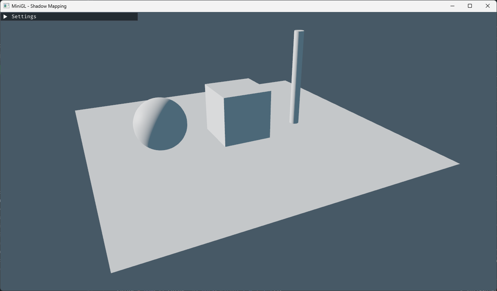
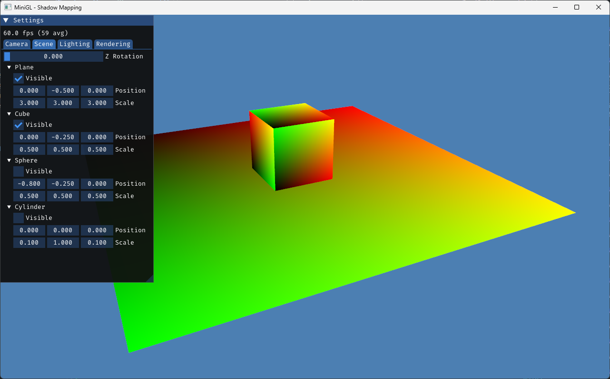
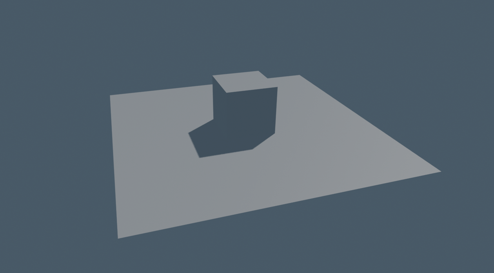
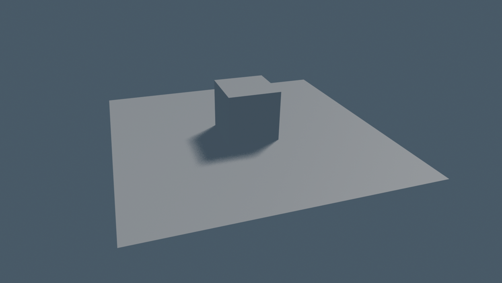
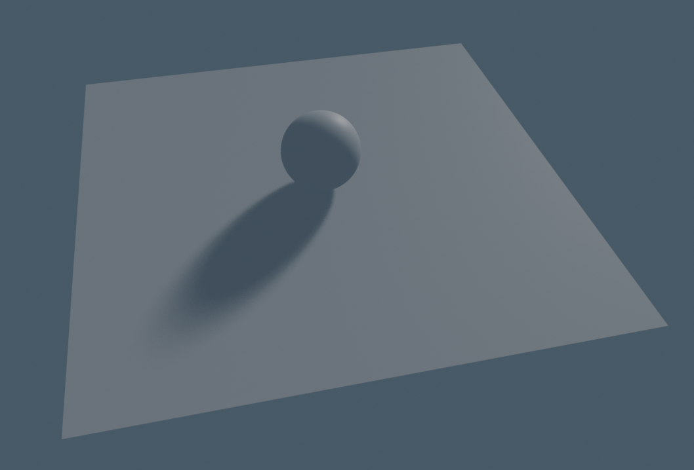
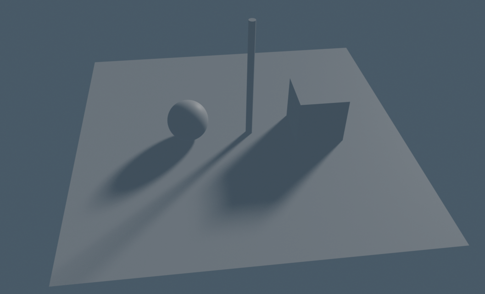

# MiniGL - Shadow Mapping

Exploring _Shadow Mapping_ and it's various problems. for other examples search for "minigl" in my github repositories.



## TODO

- [x] Cube
- [x] Plane
- [x] Sphere
- [x] Cylinder
- [x] Camera Movement
- [ ] Blinn-Phong
- [ ] Shadow Mapping
- [ ] Bias
- [ ] Normal Bias
- [ ] PCF
- [ ] PCSS
- [ ] Jitter

## Dependencies

- CMake
- GLFW
- glad
- imgui
- glm

## Build

```bash
mkdir build
cd build
cmake ..
cmake --build .
```

## Progress

| Stage       | Image                                    |
| ----------- | ---------------------------------------- |
| Blinn-Phong |  |
| Scene done  |       |

## References

Reference screenshots from Blender

| Name               | Image                                       |
| ------------------ | ------------------------------------------- |
| Hard Shadow        |       |
| Soft Shadow        |       |
| Sphere PCSS        |  |
| Light Jitter (WTF) |              |

## Credits

- [PCSS paper by Nvidia](https://developer.download.nvidia.com/shaderlibrary/docs/shadow_PCSS.pdf)

By Gholamreza Dar 2025
