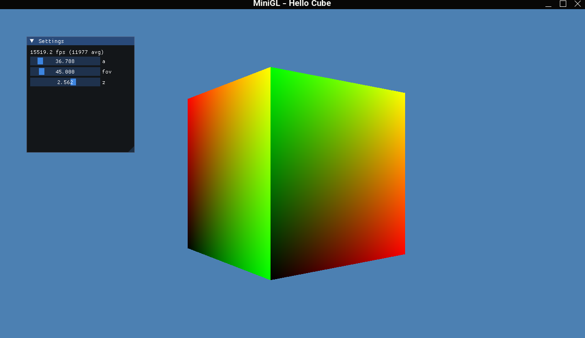

# MiniGL - Hello Cube

A simple minigl example that renders a cube with a simple shader. for other examples search for "minigl" in my github repositories.



## Dependencies

- CMake
- GLFW
- glad
- imgui
- glm

## Build

```bash
mkdir build
cd build
cmake ..
cmake --build .
```

## Credits

By Gholamreza Dar 2025
