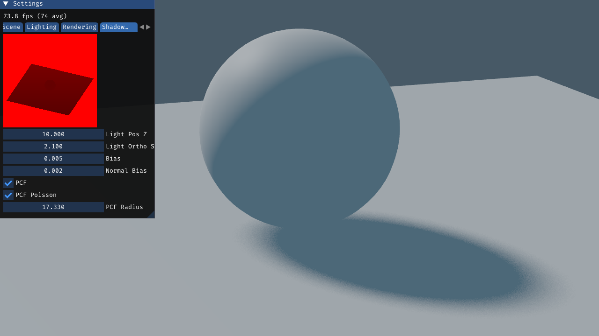
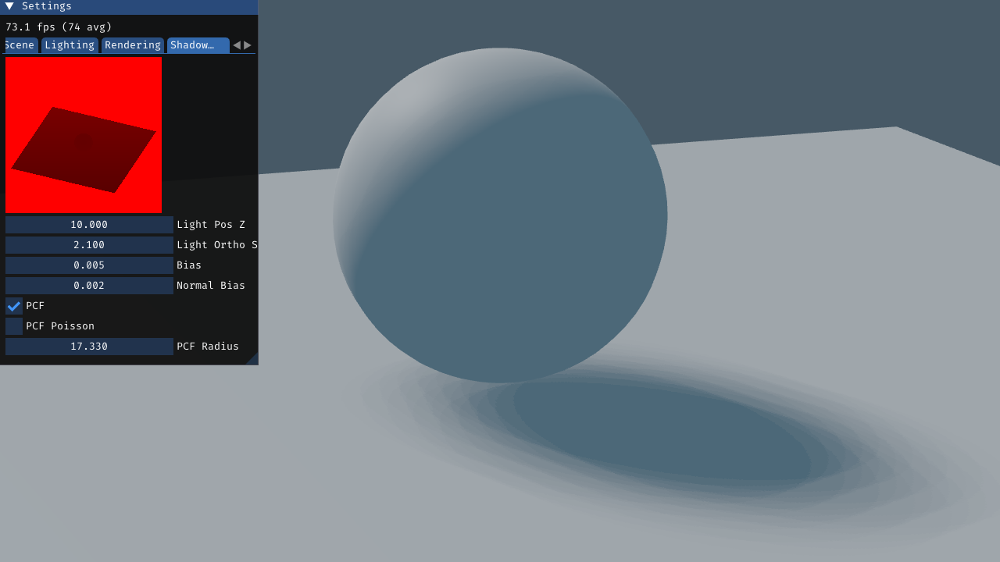
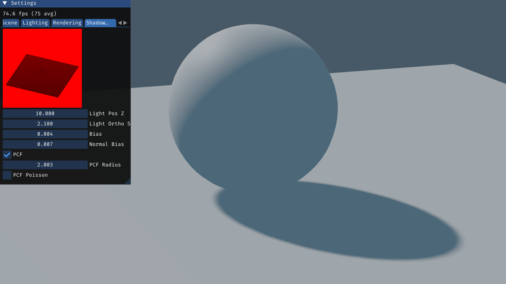
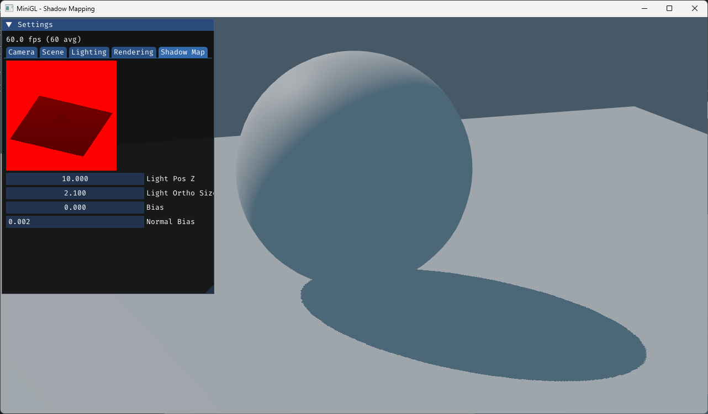
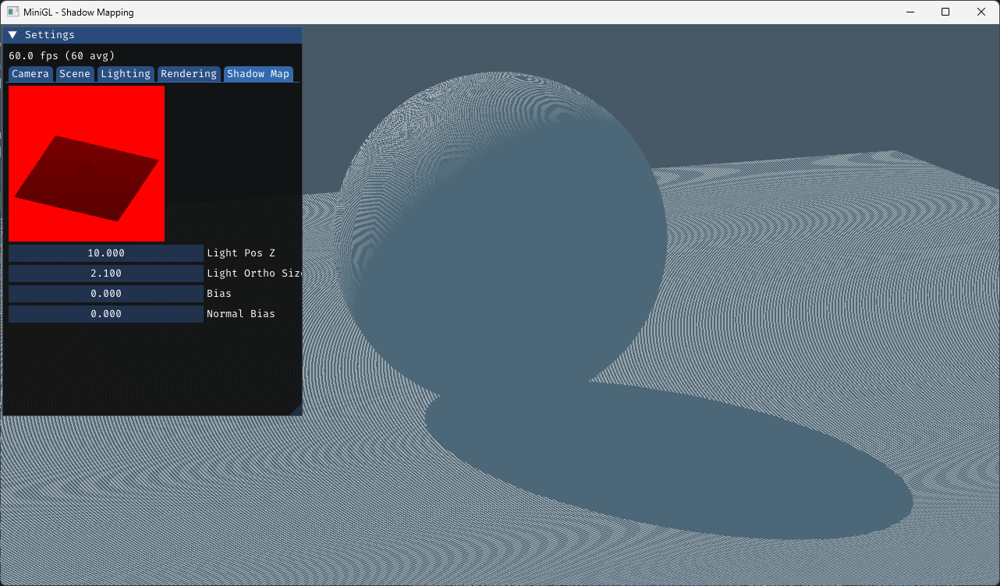
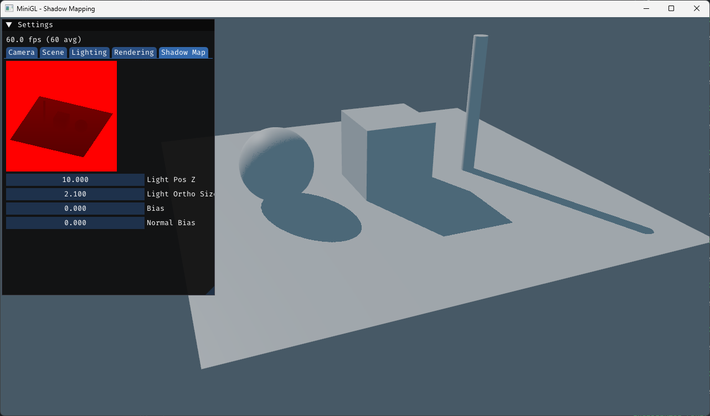
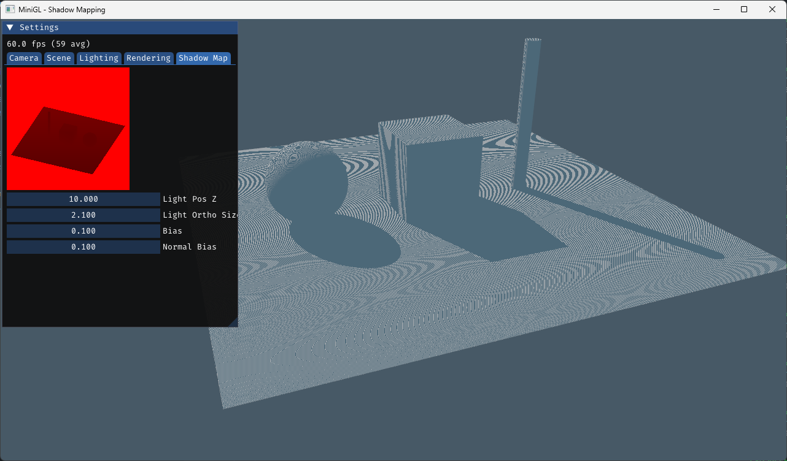

# MiniGL - Shadow Mapping

Exploring _Shadow Mapping_ and it's various problems. for other examples search for "minigl" in my github repositories.


## TODO

- [x] Cube
- [x] Plane
- [x] Sphere
- [x] Cylinder
- [x] Camera Movement
- [x] Blinn-Phong
- [x] Shadow Mapping
- [x] Bias
- [x] Normal Bias
- [x] PCF
- [ ] PCSS
- [ ] Jitter

## Progress

| Stage                          | Image                                           |
| ------------------------------ | ----------------------------------------------- |
| PCF Poisson high radius        |  |
| PCF 5x5 high radius            |   |
| PCF 5x5                        |                         |
| Bias 0.0003, Normal Bias 0.002 |      |
| Bias 0.0003, Normal Bias 0     |          |
| Bias 0, Normal Bias 0          |               |
| Bias                           |                   |
| First Shadow                   |          |
| Blinn-Phong                    |         |
| Scene done                     |              |

## References

Reference screenshots from Blender

| Name               | Image                                       |
| ------------------ | ------------------------------------------- |
| Hard Shadow        |       |
| Soft Shadow        |       |
| Sphere PCSS        |  |
| Light Jitter (WTF) |              |

## Dependencies

- CMake
- GLFW
- glad
- imgui
- glm

## Build

```bash
mkdir build
cd build
cmake ..
cmake --build .
```

```bash
time cmake --build build -j && build/Debug/minigl_shadow_mapping.exe
```

## Credits

- [PCSS paper by Nvidia](https://developer.download.nvidia.com/shaderlibrary/docs/shadow_PCSS.pdf)
- [Babylon.js Shadow Mapping Deep Dive](https://doc.babylonjs.com/features/featuresDeepDive/lights/shadows/)
- [The Witness Shadow Mapping](http://the-witness.net/news/2013/09/shadow-mapping-summary-part-1/)
- [Cherno Shadow Mapping](https://www.youtube.com/watch?v=qbDrqARX07o0)

By Gholamreza Dar 2025
